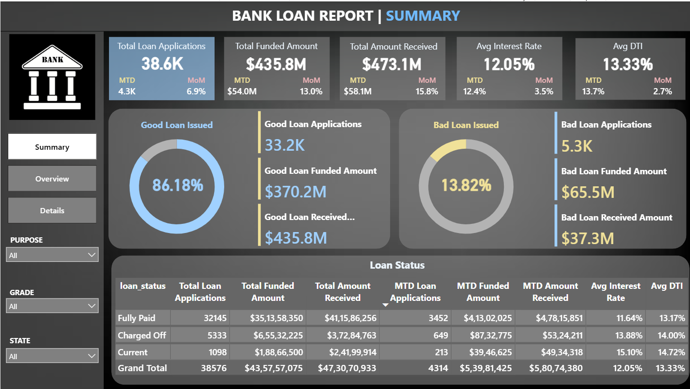
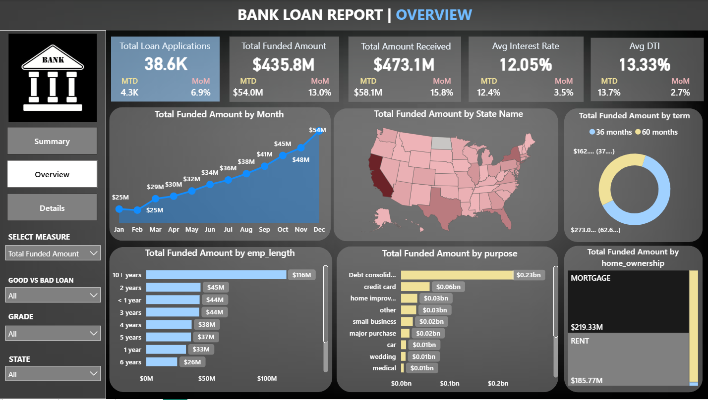
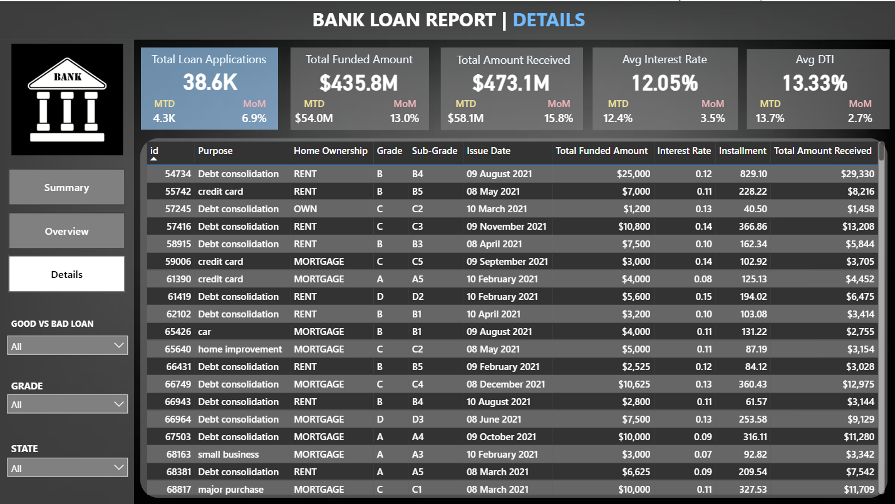

# Bank Loan Risk Analysis Dashboard

An interactive **Power BI** solution that delivers end-to-end risk analysis on a $435M+ loan portfolio. Designed for data-driven lending teams, this report combines high-level KPIs, exploratory visuals, and granular records to support strategic decision-making and operational transparency.

---

## 📸 Dashboard Previews

### Page 1: Summary  
Executive overview of portfolio performance and risk segmentation.  


- **High-Level KPIs:** Total applications, funded & received amounts, Avg. Interest Rate, Avg. DTI (Month-to-Date vs. Month-over-Month)  
- **Risk Segmentation:** ‘Good’ vs. ‘Bad’ loan proportions with counts and amounts  
- **Loan Status Table:** Breakdown by Fully Paid, Charged Off, Current  

---

### Page 2: Overview  
In-depth trend and demographic analysis of funded amounts.  


- **Time Series:** Monthly funded volume (Jan – Dec)  
- **Geographic Heatmap:** State-level loan distribution  
- **Borrower Profile:** Funding by employment length and homeownership  
- **Purpose & Term:** Loan purpose breakdown and 36 vs. 60-month term comparison  

---

### Page 3: Details  
Tabular view of individual loan records for drill-down and validation.  


- **Loan Metadata:** ID, issue date, purpose, grade/sub-grade  
- **Financial Metrics:** Funded amount, received amount, installment, interest rate  
- **Filterable Fields:** Loan status, borrower state, grade, homeownership  

---

## 🔑 Key Takeaways

- **Default Risk Concentration:** 13.8% of loans charged off, predominantly in lower grades (C–E).  
- **DTI & Income Insights:** Higher DTI (>20%) correlates with elevated default rates.  
- **Seasonal Growth:** Funded amount rises steadily from $25M (Jan) to $54M (Dec).  
- **Primary Use Cases:** Debt consolidation dominates, followed by credit cards and home improvement.  

---

## 🛠️ Technical Summary

- **Platform:** Power BI Desktop  
- **Data Prep:** Power Query & Excel  
- **Visuals:** KPI cards, bar/column charts, line charts, maps, donut charts, tables, slicers  
- **Data Source:** Anonymized loan application dataset (~38.6K records)

---

## 📂 Repository Structure

```

loan-risk-analysis/
├── Loan\_Risk\_Analysis.pbix      # Full Power BI report
├── dashboard\_Page1  # Page 1 preview
├── dashboard\_Page2 # Page 2 preview
├── dashboard\_Page3  # Page 3 preview
└── README.md         # Project documentation

````

---

## 🚀 Getting Started

1. **Clone repository**  
   ```bash
   git clone https://github.com/your-username/loan-risk-analysis-dashboard.git
   cd loan-risk-analysis
````

2. **Open report**
   Launch `Loan_Risk_Analysis.pbix` in Power BI Desktop.
3. **Interact & Export**
   Use slicers and drill-throughs to filter data; export visuals or data as needed.

---

## 🎯 Skills Demonstrated

* Data modeling & ETL (Power Query)
* Interactive dashboard design (Power BI)
* Risk analysis & KPI development
* Data storytelling for stakeholders

---

## 🤝 Get in Touch

* **GitHub:** [your-username](https://github.com/Saif907)
* **LinkedIn:** [Your Name](https://www.linkedin.com/in/saif-shaikh-527346251)
* **Email:** [your.email@example.com](mailto:saif81868@gmail.com)

---


